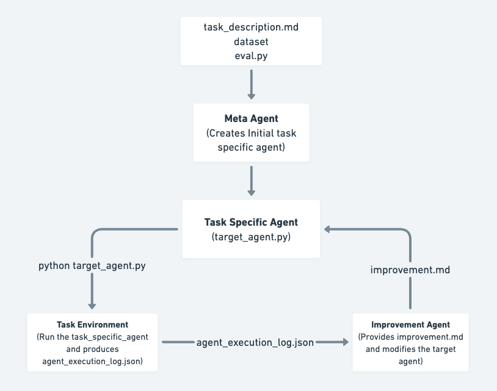
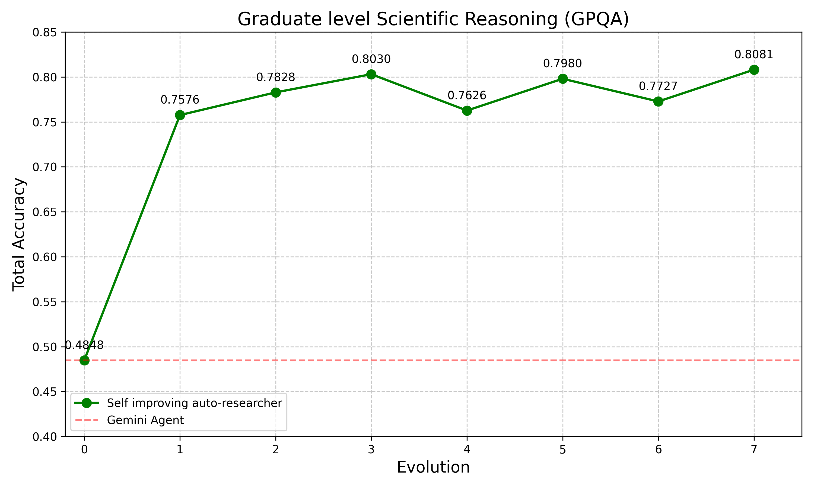
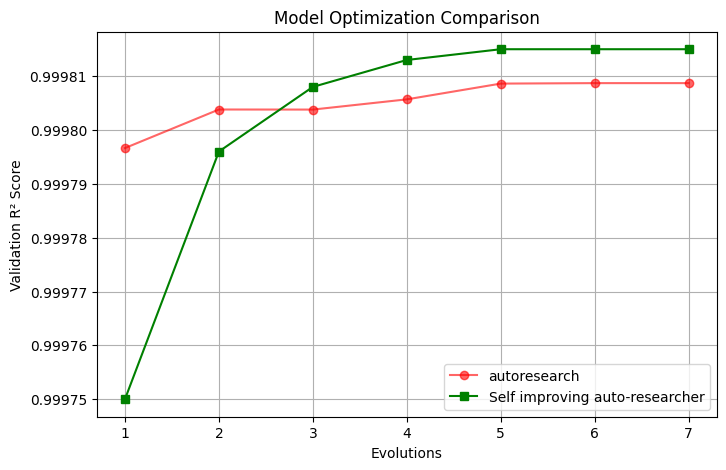

# SIA (Self-Improving AI)

Our goal is to build a self-improving AI scientist that can autonomously go ahead and improve its performance on scientific tasks.

> **Just want to try it?** Skip to [Run SIA locally](#2-run-sia-locally-with-built-in-tasks).

---

## 1. What is SIA

### Architecture

<p align="center"></p>

Three agents work in a loop:

1. **Meta-Agent** — Reads the task and writes the initial Target Agent.
2. **Target Agent** — Attempts the task and logs its actions and results.
3. **Feedback Agent** — Reviews the logs, identifies improvements, and rewrites the Target Agent for the next generation.

For directory layout, the per-generation execution flow, and prompt customization, see [docs/architecture.md](docs/architecture.md).

### Results

<table width="100%">
  <tr>
    <td width="50%" align="center"></td>
    <td width="50%" align="center"></td>
  </tr>
</table>

<p align="center"><i>Performance climbs across generations of self-improvement on GPQA and an MLE-Bench task.</i></p>

---

## 2. Run SIA locally with built-in tasks

The wheel ships four ready-to-run tasks: `gpqa`, `lawbench`, `longcot-chess`, `spaceship-titanic`.

### Install

Pick the backend that matches the LLMs you want to run.

**Claude backend** (Claude Agent SDK, Claude models only):

```bash
python3 -m venv .venv && source .venv/bin/activate
pip install 'sia-agent[claude]'
export ANTHROPIC_API_KEY="..."
```

**OpenHands backend** (multi-provider — Gemini, OpenAI, Anthropic, etc.):

```bash
python3 -m venv .venv && source .venv/bin/activate
pip install 'sia-agent[openhands]'

# Export the key(s) for the provider(s) you'll use:
export ANTHROPIC_API_KEY="..."   # for anthropic/* models
export GEMINI_API_KEY="..."      # for gemini/* models (or GOOGLE_API_KEY)
export OPENAI_API_KEY="..."      # for openai/* models
```

Full provider/model reference: [docs/configuration.md](docs/configuration.md#api-keys).

### Run

```bash
sia --task gpqa --max_gen 5 --run_id 1
```

That's it — no clone, no dataset setup. Swap `--task` for any of the four bundled tasks.

Artifacts land in `runs/run_{run_id}/gen_{n}/`:
- `target_agent.py` — the agent for that generation
- `agent_execution.json` — execution logs
- `improvement.md` — diff rationale (gen 2+)

### Common flags

| Flag | Default | Description |
|---|---|---|
| `--task` | — | Bundled task name (mutually exclusive with `--task_dir`) |
| `--task_dir` | — | Path to an external task directory |
| `--max_gen` | 3 | Number of self-improvement generations |
| `--run_id` | 1 | Unique run identifier |
| `--backend` | `claude` | `claude` (Claude Agent SDK) or `openhands` (multi-provider) |
| `--meta_model` | `haiku` | Meta/feedback model (e.g. `haiku`, `sonnet`, `opus`, or `gemini/...`, `openai/...` with openhands) |
| `--task_model` | `claude-haiku-4-5-20251001` | Target agent model |

Full backend, model, and API-key reference: [docs/configuration.md](docs/configuration.md). Hit a snag? [docs/troubleshooting.md](docs/troubleshooting.md).

---

## 3. Bring your own task

Point `--task_dir` at any directory with this layout:

```
my-task/
├── data/
│   ├── public/
│   │   ├── task.md          # Task description — SIA reads this
│   │   └── ...              # Inputs the agent is allowed to see
│   └── private/             # Held-out eval data; never exposed to the agent
└── reference/
    ├── reference_target_agent.py     # Template; copy from sia/tasks/_shared/
    └── SAMPLE_TASK_DESCRIPTIONS.md   # Optional: example tasks for the meta-agent
```

Then:

```bash
sia --task_dir ./my-task --max_gen 5 --run_id 1
```

### From an MLE-Bench task

Install the extras first (mle-bench is not on PyPI, so it ships as a git install):

```bash
pip install 'sia-agent[mlebench]'
pip install git+https://github.com/openai/mle-bench
export KAGGLE_USERNAME="..." KAGGLE_KEY="..."   # mle-bench downloads competitions via the Kaggle API
export GEMINI_API_KEY="..."                     # optional; needed only for sample task generation
```

Kaggle credentials come from your account's API token (Account → Create New Token); you can also drop the downloaded `kaggle.json` at `~/.kaggle/kaggle.json` instead of exporting env vars. You must also accept the competition's rules on Kaggle before `mlebench prepare` can pull it.

Then:

```bash
python -m sia.prepare_mlebench_dataset -c "spaceship-titanic"
```

This runs `mlebench prepare`, copies the public/private splits, renames `description.md` → `task.md`, generates sample task descriptions via Gemini (use `--skip-gemini` to skip), and drops in the reference agent template.

For the detailed step-by-step (dataset placement, sample task descriptions, analyzing results), see [docs/walkthrough.md](docs/walkthrough.md).

---

## Further reading

- [docs/architecture.md](docs/architecture.md) — directory layout, generation flow, prompt customization
- [docs/walkthrough.md](docs/walkthrough.md) — detailed custom-task walkthrough
- [docs/configuration.md](docs/configuration.md) — backends, models, API keys, CLI reference
- [docs/troubleshooting.md](docs/troubleshooting.md) — common errors and fixes
