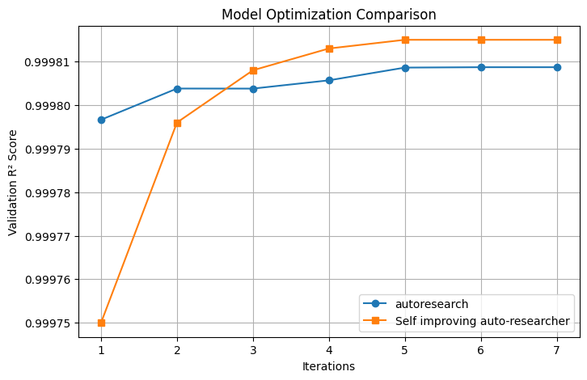

# SIA (Self-Improving Auto-researcher)
Our goal is to build a self-improving AI scientist that can autonomously go ahead and improve its performance on scientific tasks. 

## Results
Below are example results showing progressive improvement of SIA on scientific tasks:

<table width="100%">
  <tr>
    <td width="50%" align="center"><br></td>
    <td width="50%" align="center"><br></td>
  </tr>
</table>

<p align="center"><i>Figure: Model performance plots show the improvement of SIA over multiple generations of self-improvement across tasks.</i></p>


## Overview

<p align="center"></p>
<p align="center"><i>Figure: How the orchestrator runs Meta-, Target, and Feedback agents over successive generations.</i></p>

SIA operates by coordinating three main types of AI agents that work together to continuously improve task performance:

### Glossary
1. **Meta-Agent**: Reads the task description and generates an initial Target Agent tailored to the task.
2. **Target Agent**: Attempts to complete the task and records its actions and results.
3. **Feedback/Improvement Agent**: Reviews the Target Agent's performance logs, identifies improvements, and updates the Target Agent accordingly.

This iterative process allows the system to autonomously refine and enhance its ability to solve scientific tasks.


## Directory Structure

```
sia/
├── orchestration/
│   ├── orchestrator.py             # Main loop: meta-agent → target agent → feedback agent
│   │                               # The meta-agent and feedback-agent prompts live here —
│   │                               # there are no separate meta_agent.py / feedback_agent.py files
│   ├── util.py                     # run_agent(): Claude Code SDK and OpenHands backends
│   ├── context_manager.py          # Tracks scores and evolution across generations
│   ├── plot_utils.py               # Plots private scores at end of run
│   └── prepare_mlebench_dataset.py # Helper to bootstrap MLE-Bench tasks
├── tasks/
│   ├── _shared/
│   │   ├── reference_target_agent.py    # Generic reference agent template
│   │   └── sample_agent_execution.json  # Example trajectory shown to meta-agent
│   └── {task-id}/
│       ├── data/
│       │   ├── public/
│       │   │   ├── task.md          # Task description (read by meta-agent and target agent)
│       │   │   ├── evaluate.py      # Public evaluator — called by the target agent to score
│       │   │   │                    # its solution; writes results.json next to solution file
│       │   │   └── ...              # Public data files (read-only for target agent)
│       │   ├── private/
│       │   │   └── evaluate.py      # Private evaluator — called by the orchestrator only,
│       │   │                        # never exposed to the target agent; writes private_result.json
│       │   └── .gitignore           # (optional) exclude large data files (e.g. *.h5ad) from git
│       ├── reference/
│       │   ├── SAMPLE_TASK_DESCRIPTIONS.md  # Example tasks shown to meta-agent for context
│       │   └── reference_target_agent.py    # Task-specific reference agent shown as template
│       ├── requirements.txt         # (optional) task-specific Python dependencies installed
│       │                            # automatically into the run venv before the first generation
│       ├── download_data.sh         # (optional) downloads / prepares data files into data/public/
│       │                            # and data/private/; run once before launching the orchestrator
│       └── launch.sh                # (optional) convenience wrapper around orchestrator.py
└── runs/                         # Generated during execution (not committed)
    └── run_{id}/
        ├── venv/                 # Isolated Python environment (auto-created per run)
        ├── context.md            # Score history and evolution summary across generations
        ├── private_scores.png    # (end of run) private score curve + public as reference
        └── gen_{n}/
            ├── target_agent.py            # Agent code for this generation
            ├── agent_execution.json       # Full execution trajectory (target agent)
            ├── target_agent_stdout.log    # Combined stdout+stderr of the target agent process
            ├── results.json               # Public eval score (written by evaluate.py)
            ├── private_result.json        # Private eval score (written by orchestrator, display only)
            ├── improvement.md             # (gen 2+) feedback agent's analysis and plan
            ├── meta_agent_prompt.txt      # (gen 1) full prompt sent to meta-agent
            ├── feedback_agent_prompt.txt  # (gen 2+) full prompt sent to feedback agent
            └── openhands_trajectory/      # (OpenHands backend) meta/feedback agent trajectory
                                           # (Claude backend) trajectories go to ~/.claude/projects/
```

## Setup

### Prerequisites

1. **Python 3.11+** with venv support
2. **Create a virtual environment** (recommended):
   ```bash
   python3 -m venv .venv
   source .venv/bin/activate
   ```
3. **Install required dependencies** from `requirements.txt`:
   ```bash
   pip install -r requirements.txt
   ```
4. **API Keys**: Set the appropriate API keys based on which backend and models you plan to use:

   **For Claude Code backend (default):**
   ```bash
   export ANTHROPIC_API_KEY="your-anthropic-api-key"
   ```

   **For OpenHands backend with multiple LLMs:**
   ```bash
   # For Claude models via OpenHands
   export ANTHROPIC_API_KEY="your-anthropic-api-key"

   # For Gemini models via OpenHands
   export GOOGLE_API_KEY="your-google-api-key"
   # OR
   export GEMINI_API_KEY="your-gemini-api-key"

   # For GPT models via OpenHands
   export OPENAI_API_KEY="your-openai-api-key"

   # Generic fallback (if specific keys not set)
   export LLM_API_KEY="your-api-key"
   ```

## Example Usage

### Using SIA to build SOTA Scientifc Reasoning Agent


#### Step 1: Set Up Your Custom Task Directory and Assets

To create a new custom task (e.g., for GPQA), follow these streamlined steps:

1. **Create the task directory structure:**

   ```bash
   mkdir -p tasks/gpqa/{data/public,data/private,reference}
   ```

2. **Add your dataset and task description:**

   - Place your dataset files in the appropriate folders:
     - Public questions:
       ```bash
       cp questions.json tasks/gpqa/data/public/
       ```
     - Private answers, ground truths:
       ```bash
       cp answers.json tasks/gpqa/data/private/
       ```

     **Note:** The LLM is NOT provided any context about the `private/` folder during evaluation. This prevents cheating and ensures fair assessment.

   - Write the task description in `tasks/gpqa/data/public/task.md`.  
     Example content:
     ```markdown
     # GPQA - General Purpose Question Answering

     Answer graduate-level science questions across physics, chemistry, and biology.
     Each question has multiple choice answers. Select the correct answer.

     ## Data Format
     - questions.json: Contains questions with multiple choice options
     ```

3. **Copy the reference agent template:**

   ```bash
   cp tasks/_shared/reference_target_agent.py tasks/gpqa/reference/
   ```

4. **(Optional) Add sample task descriptions:**
   You may create `tasks/gpqa/reference/SAMPLE_TASK_DESCRIPTIONS.md` with examples of similar tasks. This helps the agent generalize better and prevents overfitting to the specific task, if that is your intention.

---

### Step 2: Run the Orchestrator

**Basic Usage (Claude backend):**
```bash
python orchestration/orchestrator.py --task_dir ./tasks/gpqa --max_gen 5 --run_id 1
```

**Using OpenHands with Gemini:**
```bash
python orchestration/orchestrator.py \
  --task_dir ./tasks/gpqa \
  --max_gen 5 \
  --run_id 1 \
  --backend openhands \
  --meta_model "gemini/gemini-3.1-pro-preview"
```

**Key Arguments:**
- `--task_dir`: Path to the task directory (e.g., `./tasks/spaceship-titanic`)
- `--max_gen`: Number of generations to evolve (default: 3)
- `--run_id`: Unique identifier for this run (default: 1)
- `--backend`: Agent backend to use: `claude` (default) or `openhands`
- `--meta_model`: Model for meta/feedback agents (default: `haiku`)

See the [Configuration](#configuration) section below for detailed backend and model options.

**What happens during execution:**

1. **Generation 1:**
   - Meta-agent reads task and creates initial `target_agent.py`
   - Target agent executes task and logs to `agent_execution.json`
   - Feedback agent analyzes and creates improved agent for Gen 2

2. **Generation 2-N:**
   - Target agent from current generation executes task
   - Feedback agent analyzes and creates next generation
   - Continues until `max_gen` is reached

3. **Output:**
   - All artifacts saved in `runs/run_{run_id}/gen_{n}/`
   - Each generation has its own `target_agent.py` and execution logs
   - Improvement notes in `improvement.md`

### Step 3: Analyze Results

```bash
# View execution logs
cat runs/run_1/gen_1/agent_execution.json

# View improvements made
cat runs/run_1/gen_2/improvement.md

# Compare agent versions
diff runs/run_1/gen_1/target_agent.py runs/run_1/gen_2/target_agent.py
```

## Task Requirements

Only three files are strictly required. Everything else is optional.

```
tasks/{task-id}/
├── data/
│   ├── public/
│   │   ├── task.md        ← required: task description
│   │   └── evaluate.py    ← required: public evaluator
│   └── private/
│       └── evaluate.py    ← required: private evaluator
└── reference/
    └── reference_target_agent.py   ← required: reference agent template
```

### Required files

**`data/public/task.md`** — read by the meta-agent and injected verbatim into the target agent's prompt. Describe the task, data format, scoring, and any constraints.

**`data/public/evaluate.py`** — called by the target agent during its improvement loop to score its solution.
- Must write `results.json` next to the solution file. Required keys:
  ```jsonc
  {
    "score": 0.87,           // numeric score for this generation
    "accuracy": 0.87,        // same value; read by context_manager to track progress
    "lower_is_better": false, // tells the plot which direction is better
    "error": null            // null on success, error string on failure
  }
  ```

**`data/private/evaluate.py`** — called by the orchestrator after each generation, never exposed to the target agent.
- Must accept `--gen-dir <path>`. The evaluator finds task artifacts (e.g. `solution.py`) inside that directory.
- Must write `private_result.json` to `<gen-dir>/private_result.json`. Required keys:
  ```jsonc
  {
    "score": 0.87,           // numeric score
    "lower_is_better": false, // tells the plot which direction is better
    "error": null            // null on success, error string on failure
  }
  ```
  The orchestrator reads both `results.json` and `private_result.json` to produce `scores.png`, which overlays the public and private score curves across generations — making it easy to spot overfitting (public improves while private does not).

**`reference/reference_target_agent.py`** — shown verbatim to the meta-agent as a concrete implementation pattern. Use the task-specific version for tasks with unusual scaffolding requirements (e.g. no tool calls, custom eval loop).

### Optional files

**`reference/SAMPLE_TASK_DESCRIPTIONS.md`** — additional task examples shown to the meta-agent for context. Helps the meta-agent generalise its scaffold rather than overfit to the specific task.

**`requirements.txt`** — task-specific Python dependencies (e.g. `anndata`, `scanpy`). Automatically installed into the run's venv before generation 1. Avoids polluting the base requirements.

**`data/.gitignore`** — exclude large data files from git (e.g. `*.h5ad`, `*.csv`). Data files are generated locally by `download_data.sh` and should not be committed.

**`download_data.sh`** — downloads and prepares data files into `data/public/` and `data/private/`. Run once before the first orchestrator launch. Keeps binary data out of the repo while making setup reproducible.

**`launch.sh`** — convenience wrapper around `orchestrator.py` with task-specific defaults (models, generation count, run ID).

> **Scientific validity**: the private evaluator must never be reachable by the target agent. The orchestrator only passes `data/public/` via `--dataset_dir`. The private score is logged for experimenter observability only — it must never be fed back as a training signal. If private score diverges from public score across generations, the agent is overfitting to the public eval set.

------

### Running SIA on MLE-Bench task

Use the `prepare_mlebench_dataset.py` script to prepare a task dataset from MLE-Bench:

```bash
python orchestration/prepare_mlebench_dataset.py -c "spaceship-titanic"
```

This will:
1. Run `mlebench prepare -c "spaceship-titanic"`
2. Copy public and private datasets from `~/.cache/mle-bench/data/prepared/`
3. Rename `description.md` to `task.md` in `data/public/`
4. Use Gemini to generate similar tasks (optional)
5. *(Optional)* Create `SAMPLE_TASK_DESCRIPTIONS.md` in `reference/`
6. Copy `reference_target_agent.py` from `_shared/` to `reference/`

**Options:**
- `--skip-gemini`: Skip Gemini API call for similar tasks
- `--tasks-dir PATH`: Specify custom tasks directory (default: `./tasks`)


5. Optionally create `SAMPLE_TASK_DESCRIPTIONS.md` manually in `reference/`


------

## Troubleshooting

### "Run directory already exists"
The orchestrator prevents overwriting existing runs. Either:
- Use a different `--run_id`
- Delete the existing run: `rm -rf runs/run_1`

### "No GEMINI_API_KEY environment variable set"
The prepare script will skip similar task generation. Either:
- Set the environment variable: `export GEMINI_API_KEY="your-key"`
- Use `--skip-gemini` flag to skip this step


### Target agent fails during execution
Check the logs in the generation directory:
```bash
cat runs/run_1/gen_1/agent_execution.json
```

Common issues:
- Dataset paths incorrect (ensure absolute paths are used)
- Missing Python packages in the venv
- ANTHROPIC_API_KEY not set

### ImportError: No module named 'anthropic'
The orchestrator creates a fresh venv for each run. If packages are missing:
1. Check the venv creation in the orchestrator logs
2. Manually install: `runs/run_1/venv/bin/pip install anthropic`

## Configuration

### Agent Backend Selection

SIA supports two agent backends for maximum flexibility:

#### 1. Claude Code Backend (Default)
Uses the Claude Agent SDK with Claude models only:

```bash
python orchestration/orchestrator.py \
  --task_dir ./tasks/gpqa \
  --max_gen 5 \
  --run_id 1 \
  --backend claude \
  --meta_model haiku
```

**Supported Models:**
- `haiku` (claude-haiku-4-5-20251001)
- `sonnet` (claude-sonnet-4-5-20250929)
- `opus` (claude-opus-4-5-20251101)

#### 2. OpenHands Backend
Uses the OpenHands SDK with support for multiple LLM providers:

```bash
python orchestration/orchestrator.py \
  --task_dir ./tasks/gpqa \
  --max_gen 5 \
  --run_id 2 \
  --backend openhands \
  --meta_model "gemini/gemini-3.1-pro-preview"
```

**Supported Models:**

**Google Gemini:**
```bash
--meta_model "gemini/gemini-3.0-pro"
--meta_model "gemini/gemini-3.1-pro-preview"
```

**OpenAI GPT:**
```bash
--meta_model "openai/gpt-4"
--meta_model "openai/gpt-4-turbo"
```

**Anthropic Claude (via OpenHands):**
```bash
--meta_model "anthropic/claude-sonnet-4-5-20250929"
--meta_model "anthropic/claude-opus-4-5-20251101"
```

### Complete Example: Testing Multiple LLMs

```bash
# Run 1: Claude via Claude Code (default)
python orchestration/orchestrator.py \
  --task_dir ./tasks/gpqa \
  --max_gen 3 \
  --run_id 1 \
  --backend claude \
  --meta_model haiku

# Run 2: Gemini via OpenHands
python orchestration/orchestrator.py \
  --task_dir ./tasks/gpqa \
  --max_gen 3 \
  --run_id 2 \
  --backend openhands \
  --meta_model "gemini/gemini-3.1-pro-preview"

# Run 3: GPT-4 via OpenHands
python orchestration/orchestrator.py \
  --task_dir ./tasks/gpqa \
  --max_gen 3 \
  --run_id 3 \
  --backend openhands \
  --meta_model "openai/gpt-4"
```

### Command-Line Arguments Reference

| Argument | Required | Default | Description |
|----------|----------|---------|-------------|
| `--task_dir` | Yes | - | Path to task directory (e.g., `./tasks/gpqa`) |
| `--max_gen` | No | 3 | Number of improvement generations |
| `--run_id` | No | 1 | Unique run identifier |
| `--backend` | No | `claude` | Agent backend: `claude` or `openhands` |
| `--meta_model` | No | `haiku` | Model for meta and feedback agents |
| `--task_model` | No | `claude-haiku-4-5-20251001` | Model for target agent execution |

### Model Selection

The default model is `haiku` (claude-haiku-4-5-20251001). To use a different model, use the `--meta_model` and `--task_model` arguments as shown above.

**Important Notes:**
- When using the `claude` backend, only Claude model names are supported (`haiku`, `sonnet`, `opus`)
- When using the `openhands` backend, use fully-qualified model names (e.g., `gemini/gemini-3.1-pro-preview`)
- Ensure the appropriate API keys are set in your environment for the models you choose

### Customizing Prompts

Edit the prompts in `orchestrator.py`:
- `META_AGENT_PROMPT`: Controls how the initial agent is created
- `FEEDBACK_AGENT_PROMPT`: Controls how improvements are suggested
